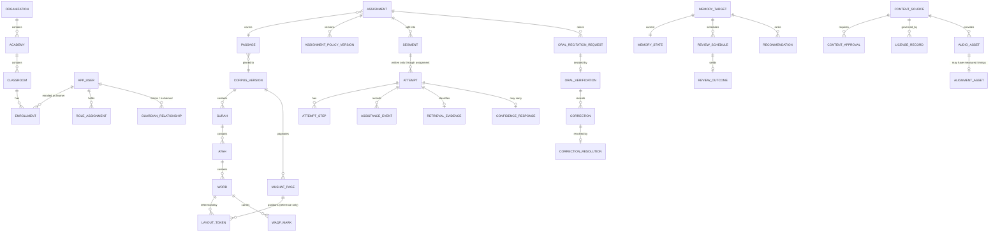

# 07 — Domain model and PostgreSQL ERD

DDL: `db/migrations/0001_init.sql`.

## Module ownership

Modules share one PostgreSQL cluster but **may not write into another module's
owned tables**, and may not bypass another module's application policies.

| Module | Owns |
|---|---|
| Identity & sessions | `app_user`, `credential`, `user_session` |
| Organizations & tenancy | `organization`, `academy`, `classroom`, `enrollment` |
| Roles & authorization | `role_assignment`, `permission_grant` |
| Sacred content & layout | `corpus_version`, `surah`, `ayah`, `word`, `mushaf_page`, `layout_token`, `waqf_mark` |
| Curriculum & assignments | `curriculum`, `unit`, `lesson`, `passage`, `assignment`, `assignment_policy_version`, `segment` |
| Learning evidence | `attempt`, `attempt_step`, `retrieval_evidence`, `assistance_event`, `confidence_response` |
| Oral verification | `oral_recitation_request`, `oral_verification`, `correction`, `correction_resolution` |
| Memory & scheduling | `memory_target`, `memory_state`, `review_schedule`, `review_outcome`, `recommendation` |
| Knowledge graph | `knowledge_node`, `knowledge_edge`, `misconception_pattern` |
| Qāʿidah | `qaida_lesson`, `qaida_skill`, `qaida_item`, `pronunciation_evidence` |
| Content governance | `audio_asset`, `alignment_asset`, `content_source`, `content_approval`, `license_record` |
| Guardianship | `guardian_relationship`, `consent_record` |
| Platform | `learning_event`, `notification`, `feature_flag`, `experiment_assignment`, `audit_log` |

## ERD (core of the Phase 1 slice)

## Invariants enforced in the database

1. **Tenancy.** Every tenant-owned row carries a non-null `organization_id`.
   Every authorization-sensitive query scopes by tenant *before* resource
   lookup. Row-level security is enabled as defence in depth — never as the
   only policy layer.
2. **Segments are writable only through their assignment.** `attempt` has a
   composite FK to `(segment_id, assignment_id)`; there is no path to write an
   attempt against a segment the assignment does not own.
3. **Verification pins everything.** `oral_verification` references the exact
   assignment, passage, `assignment_policy_version`, verifier, and the evidence
   set considered. Reconstructing "what was this teacher looking at?" is a query,
   not an archaeology project.
4. **Corpus tokens are immutable within a version.** Enforced by trigger:
   `UPDATE`/`DELETE` on `word`, `layout_token`, `waqf_mark` raises unless the
   owning `corpus_version` is still in `draft`. A correction ships as a new
   corpus version.
5. **Evidence is append-only.** No `UPDATE` on `attempt`, `retrieval_evidence`,
   `oral_verification`. Superseding decisions are new rows carrying `supersedes`,
   `reason`, and `actor`.
6. **Content release gate.** A `passage`, `audio_asset`, or `alignment_asset`
   may only be referenced by a published assignment when its `content_source`
   has an approval in `approved` state, a non-expired `license_record`, and
   territorial rights covering the academy. Enforced in the application release
   check and asserted again by a CI query.
7. **Every computed memory transition stores `algorithm_version` and
   `policy_version`.** A transition that cannot be replayed cannot be defended.
8. **Alignment honesty.** `alignment_asset.method` is an enum of measured
   methods only. There is no `estimated` value — if timings were not measured,
   the row does not exist and word highlighting is disabled with an explanation.

## Read models

Teacher dashboards, memory maps, and reports are served from denormalized read
models refreshed by workers (`teacher_attention_row`, `learner_memory_summary`,
`review_load_projection`). Large multi-domain analytical joins never run
synchronously on the transactional database on a page load.
